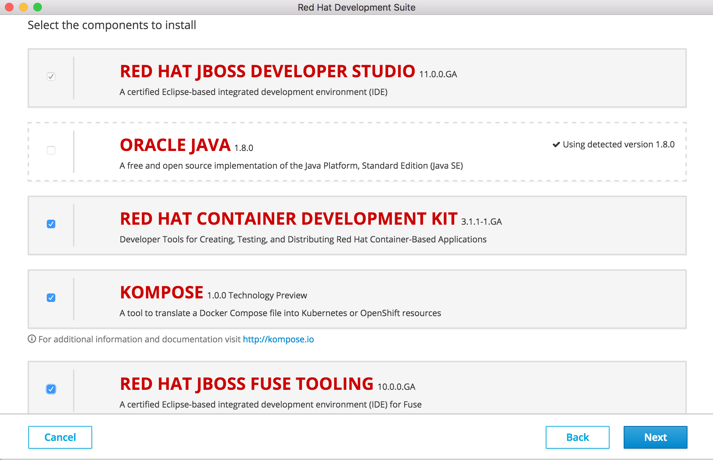

# Agile Integration ワークショップ
(Red Hat Fuse 6.3 ワークショップ - Fuse Integration Service 2.0)

これはOpenShift上で動作するFuse Spring Bootプロジェクトを作成するシンプルなハンズオンチュートリアルです。
このチュートリアルは以下の4つのセクションで構成されています。

* データベースからデータを読み込むプロジェクトを作成する
* RESTful APIエンドポイントを公開する
* 作成したアプリケーションをOpenShiftにデプロイする
* 3scaleを使ってAPIを管理・制御する

## Red Hat 3scale API管理プラットフォームのアカウント登録
このチュートリアルではRed Hat 3scaleのデプロイと管理にフォーカスします。
ここで紹介するデプロイパターンはハイブリッドアプローチというものです。ハイブリッドアプローチは3scaleのAPIゲートウェイを自分の環境に設定する方法です。
このゲートウェイはパブリッククラウドで管理された、Red Hat 3Scale SaaS API管理プラットフォーム (以下AMP）と双方向通信を行います。


lab4のチュートリアルでこのハイブリッドアプローチを使いますので、事前にRed Hat 3Scale SaaS AMPの無料トライアルアカウントを登録してください。（ https://www.3scale.net/signup ）

登録したメールアドレスにメールが届きますので、アカウントのアクティベーションを行い登録プロセスを完了します。

## インストール
以下のソフトウェアが事前にインストールされていることを確認してください。

* JBoss Development Suite V2.0.0 (MacOSX/Windows)
	* JBoss Developer Studio 11.0.0.GA (Red Hat JBoss Fuse Tooling 11.0.<0 class="GAもインストールされていること"></0>)
	https://developers.redhat.com/products/devsuite/download/
	* Java Platform, Standard Edition 1.8.x
	* Red Hat Container Development Kit 3.1.0-1.GA

## 開発環境のインストールと設定
JBoss Development Suiteをダブルクリックし、あなたが登録したRed Hat Developerサイトの認証情報でログインします。


インストールフォルダの宛先を指定します。
インストーラーで指定したバージョンのコンポーネントを選択し、コンポーネントのダウンロードとインストールが開始されます。



インストールが終わると、プロジェクトのワークスペースを選択する画面が表示されます。任意の場所を指定してください。

Red Hat JBoss Developer Studioの画面の真ん中のパネルにある "Software/Update"タグを選択します。"JBoss Fuse Development"ボックスをクリックし、Install/Update ボタンをクリックします。


Red Hat JBoss Developer Studioが再起動されます。

## コンテナ開発キット（Container Development Kit）をインストールし設定する

Development Suiteをインストールしたフォルダの直下に、 **cdk** という名前のフォルダがあります。

コマンドラインコンソールでローカルのOpenShiftを起動します。

```
./minishift start
```

以下のURLから Access OpenShift コンソールにアクセスします。

```
https://<割り当てられたIPアドレス>:8443
```

Red Hat JBoss Developer Studioにビュー戻り、OpenShift Explorer ビューで **New Connection Wizard..** をクリックして OpenShiftを設定します。
**Server** に **https://<割り当てられたIPアドレス>:8443** を入力し、**retrieve** リンクをクリックしてトークンを入手します。


ポップアップウィンドウでdeveloper/developerでログインします。OKを選択して **Save token** ボックスをチェックします。


