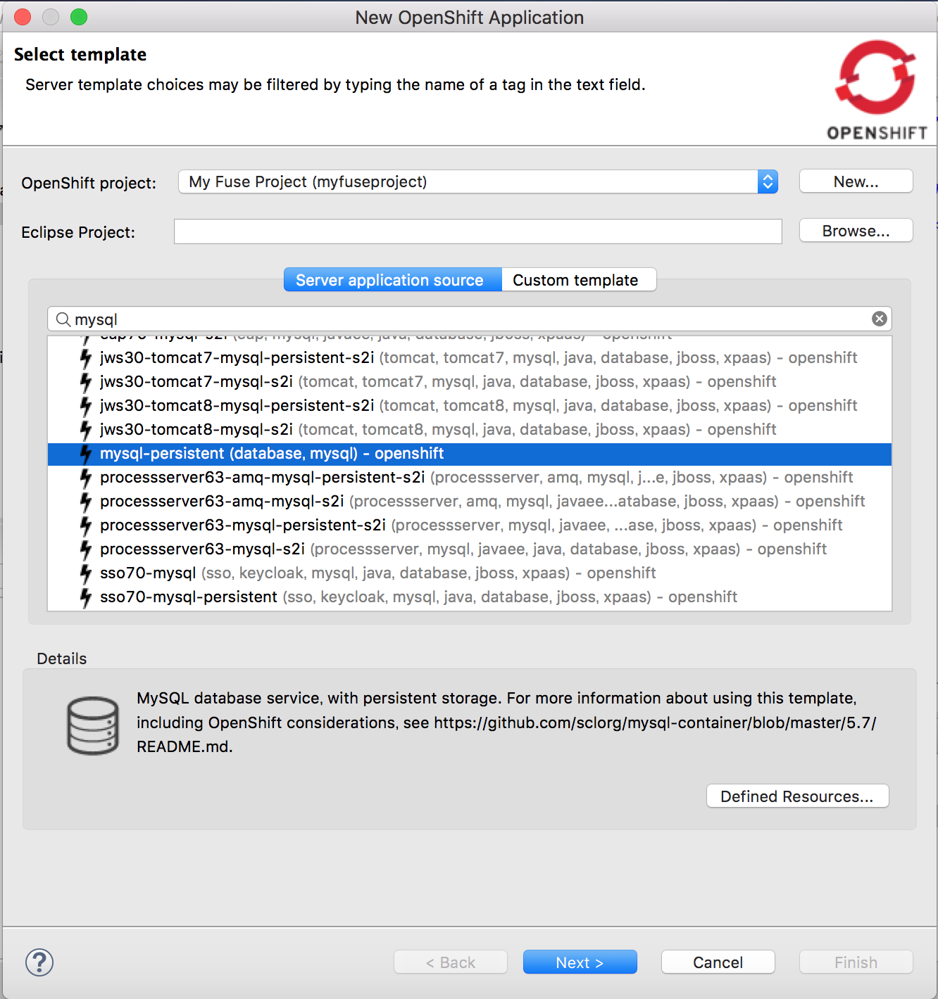

## Lab 3 - OpenShiftにデプロイする

###CDKを起動する

OpenShiftを起動するため、コマンドプロンプトを開いて以下のコマンドを実行します。

```
minishift start
```

注意：Amazon EC2での集団ワークショップでは、個別のサブスクリプション認証が必要なminishiftではなく、以下のコマンドを使用してください。
```
oc-cluster up your_name
```

ブラウザから https://<OPENSHIFT-IP>:8443/console にアクセスして、OpenShiftコンソールを表示します。 


OpenShiftにアプリケーションをデプロイする前に、これまでインメモリのH2データベースだったものから正規のMySQLデータベースで実行できるようにします。
以下のデータソース設定を、 *src/main/resources* フォルダにある **application.properties** ファイルに追加します。

```
#mysql specific
mysql.service.name=mysql
mysql.service.database=sampledb
mysql.service.username=dbuser
mysql.service.password=password

#Database configuration
spring.datasource.url = jdbc:mysql://${${mysql.service.name}.service.host}:${${mysql.service.name}.service.port}/${mysql.service.database}
spring.datasource.username = ${mysql.service.username}
spring.datasource.password = ${mysql.service.password}
```

今回はMySQL データベースを使うため、**pom.xml** にドライバーの依存性を追加します。

```
<dependency>
      <groupId>org.springframework.boot</groupId>
      <artifactId>spring-boot-starter-jdbc</artifactId>
</dependency>
<dependency>
      <groupId>mysql</groupId>
      <artifactId>mysql-connector-java</artifactId>
      <scope>runtime</scope>
</dependency>
```


トップメニューから Window -> Show view -> Others を選択します。ポップアップウィンドウでOpenShiftを検索し、OpenShift Explorerを選択します。


OpenShift Explorerの現在接続中のOpenShiftを右クリックして、**NEW** -> **Project** から新規プロジェクトを作成します。


プロジェクト名を **myfuseproject** 、表示名を **My Fuse Project** とします。


新しく作ったプロジェクト名を右クリックして、**myfuseproject** -> **New** -> **Application**を選択してMySQLデータベースを作成します。


Server application sourceで、**mysql-persistent(database, mysql) - openshift** を選択してNextをクリックします。



以下のパラメータを設定します。

```
MYSQL_PASSWORD = password
MYSQL_USER = dbuser
```


Finishをクリックすると、OpenShift Explorerにmysqlインスタンスが実行されていることが確認できます。


いよいよ作成したアプリケーションをOpenShiftにプッシュしましょう。プロジェクトを右クリックし、**Run As** -> **Run Configurations...** を選択します。


ポップアップメニューの左パネルで、**Deploy myfuselab on OpenShift** を選択します。**JRE** タブを選択し、VM argumentsの以下の引数を編集します。
-Dkubernetes.master=https://<OPENSHIFT-IP>:8443
-Dkubernetes.namespace=**myfuseproject** 
-Dkubernetes.auth.basic.username=**developer**
-Dkubernetes.auth.basic.password=**developer**
最後に**RUN**をクリックして実行します。


正常に動作していることを確認するため、 *https://<OPENSHIFT_IP>:8443/console* にdeveloperでログインし、**My Fuse Project** を選択します。FuseアプリケーションおよびMySQLデータベースが実行されていることを確認します。


OpenShiftの外のサービスにアクセスするため、左のメニューから**Application** -> **Service** を選択し、サービスページにある **camel-ose-springboot-xml** を選択します。


**Create Route**　をクリックします。


そのままCreateをクリックします。

以下のURLでAPIエンドポイントにアクセスします。

```
curl http://<YOUR_ROUTE>/myfuselab/customer/all
curl http://<YOUR_ROUTE>/myfuselab/customer/A01
```

顧客データがJSONフォーマットで返ってくることを確認します。
```
[{"CUSTOMERID":"A01","VIPSTATUS":"Diamond","BALANCE":1000},{"CUSTOMERID":"A02","VIPSTATUS":"Gold","BALANCE":500}]

[{"CUSTOMERID":"A01","VIPSTATUS":"Diamond","BALANCE":1000}]
```
Camelルートの実行状況を確認するためには、OpenShift コンソールから**Application** -> **pod** に行き、先頭の **camel-ose-springboot-xml-1-xxxxx** ポッドを選択します。


**Open Java Console** をクリックし、Camelルートの状態を確認することができます。


**Route Diagram** をクリックし、実行中の状況を確認することができます。


下記のようにMySQLデータベースにログインして、データベースの内容を確認することもできます。

```
oc project myfuseproject

oc get pods
NAME                                   READY     STATUS    RESTARTS   AGE
camel-ose-springboot-xml-s2i-1-build   1/1       Running   0          15s
mysql-1-xxxxx                          1/1       Running   0          2m

oc rsh mysql-1-xxxxx

sh-4.2$ mysql -udbuser -p sampledb
Enter password: 

mysql> select * from customerdemo;
+------------+-----------+---------+
| customerID | vipStatus | balance |
+------------+-----------+---------+
| A01        | Diamond   |    1000 |
| A02        | Gold      |     500 |
+------------+-----------+---------+
2 rows in set (0.00 sec)
```