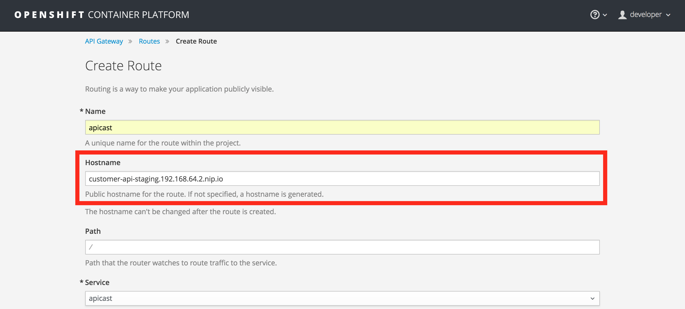

Lab 4 : 作成したAPIを管理する
===

### 作成した顧客APIを、3scale API Managementで管理する

作成した顧客APIを3scaleで管理するためには、次の3つのステップを実行する必要があります。

1. 3scale Admin Portalにアクセスし、サービスを設定します。
1. デベロッパーポータルをカスタマイズし、開発者としてログインします。
1. 3scaleのAPIゲートウェイを通じて、作成したAPIを利用します。

### ステップ0: 事前準備

オンプレミスの API gateway 環境を構築する前に、以下の3scale SaaSアカウントに関する情報を確認してください。

1. 3scale ドメインを取得する
    * 事前準備で取得した3scaleのドメインを確認します。
    * ドメイン名は管理者ポータルのURLから確認できます。
    　https://&lt;ドメイン名&gt;-admin.3scale.net

1. 3scale アクセストークンを取得する
    * アクセストークンを取得するためには、以下の手順を実行してください。

        `右上の歯車のアイコン -> Personal Settings -> Tokens -> Add Access Token`

        

        

        

        

    + アクセストークンのスコープは *Account Management API* とします。

    * またアクセストークンの権限は *Read Only* とします。

        

    > **注意:** このトークンをコピーしてください。万が一忘れた場合は、新しく作成することも可能です。

### ステップ1: APIcastをOpenShiftテンプレートを使ってデプロイする


1. デフォルトでは*developer*でログインされているのでそのまま次のステップに移ります。

   developerでログインされていない場合は、OpenShiftの`oc login` コマンドを使ってログインします。

    ```
    oc login -u developer https://<OPENSHIFT-SERVER-IP>:8443
    ```

2. プロジェクトを作成します。今回はdisplay nameを *API Gateway* とします。

    ```
    oc new-project "3scalegateway" --display-name="API Gateway" --description="3scale API gateway"
    ```

    以下のようなレスポンスになります。

    ```
    Now using project "3scalegateway" on server "https://172.30.0.112:8443".
    ```

1. 3scale管理ポータルを参照するための新しいシークレットを作成します。

    ```
    oc secret new-basicauth apicast-configuration-url-secret --password=https://<ACCESS_TOKEN>@<DOMAIN>-admin.3scale.net
    ```

    **&lt;ACCESS_TOKEN&gt;** は、3scaleのAccount Management API用に取得したアクセストークンを指定します。 **&lt;DOMAIN&gt;-admin.3scale.net** は、あなた自身で取得した3scale管理者ポータルのURLです。

    以下の応答が返ってきます。

    ```
    secret/apicast-configuration-url-secret
    ```

1. APIcast Gateway をテンプレートから生成してデプロイします。

    ```
    oc new-app -f https://raw.githubusercontent.com/3scale/3scale-amp-openshift-templates/2.0.0.GA-redhat-2/apicast-gateway/apicast.yml
    ```

    成功すると以下のメッセージが返ってきます。

    ```
    --> Creating resources ...
      deploymentconfig "apicast" created
      service "apicast" created
    --> Success
      Run 'oc status' to view your app.
    ```

1. OpenShiftのコンソールを開きます。 https://&lt;OPENSHIFT-SERVER-IP&gt;:8443/console/

    ログイン画面が表示されます。

    

1. `developer` アカウントでログインします。

    プロジェクト一覧が表示され、先ほど作成した *API Gateway* プロジェクトも含まれていることを確認します。

    

1. *API Gateway* をクリックし *Overview* タブを表示します。

    それぞれのAPIcast インスタンスは、開始時に必要となる設定（先ほど3scale管理者ポータルで設定した情報）をダウンロードします。

    

1. APIcastインスタンスがトラフィックを受け付けるようにするためには、ルートを作成する必要があります。 **Create route**をクリックします。

    

    まずはステージング用のルートを作成します。
    **Name:** `apicast-staging`

    **Hostname:** `customer-api-staging.<OPENSHIFT-SERVER-IP>.nip.io`
    その後 **Create** ボタンをクリックします。

    

1. 本番用ルートも追加します。左側のメニューから`Applications -> Routes` を選択します。

    

1. `Create Route` ボタンをクリックします。

    

1. 情報を入力します。

    **Name:** `apicast-production`

    **Hostname:** `customer-api-production.<OPENSHIFT-SERVER-IP>.nip.io`

    

1. `Create` ボタンをクリックして本番用ルートを保存します。

    これでAPI Gateways はトラフィックを受け付ける準備ができました。OpenShift は、2つのAPIcastインスタンスでロードバランスを自動的に行います。

    APIcast のログを見る場合は、**Applications > Pods** をクリックし、どちらかのpodを選択して **Logs** タブを選択します。


### ステップ2: APIを定義する

3scale管理者ポータル (http://&lt;YOURDOMAIN&gt;-admin.3scale.net) でAPIの設定を行います。

1. Admin Portalにログインする

    

1. 3scale ポータルのアクセスが初めての場合、クイックスタートの画面になります。上部右側にある **X** をクリックしてウィザードを閉じてください。

    

1. 最初にAPIタブが表示されます。ここでAPIの定義を作成します。まずは `Integration` リンクをクリックしてください。

    

1. `edit integration settings` をクリックしてゲートウェイの設定を編集します。

    

1. **APIcast self-managed** ゲートウェイ用デプロイオプションを選択します。

    

1. **API Key (user_key)** 認証を選択します。

    

1. **Update Service**をクリックします。

1. **add the Base URL of your API and save the configuration** ボタンをクリックします。

1. **mapping rules** セクションを開き、公開するAPIの計測したいメトリクスを定義します。

    > **注意:** デフォルトのマッピングルールはルート ("/") となっています。

    

1. **Metric or Method (Define)** リンクをクリックします。

    

1. *Methods* セクションの **New Method** リンクをクリックします。

    

1. メソッド情報を入力します。

    **Friendly name:** `Get Customers`

    **System name:** `customers_all`

    **Description:** `Method to return all customers`

    

1. **Create Method** をクリックします。

1. **オプション:** 前のLabで`{id}`をキーに検索するWebサービスも作成している場合、`Get Customer` メソッドを追加してください（メソッド名を`customer_get`とします）。

1. **Add mapping rule** リンクをクリックします。

    

1. GET mapping rule の右側にあるeditアイコンをクリックします。

    

1. パターンとして `/myfuselab/customer/all` を入力します。

1. メソッドとして `customers_all` を入力します。

    

1. *オプション:* **Add Mapping Rule** ボタンをクリックして `customer_get` メソッドマッピングを追加します。

1. 作成したAPIにアクセスするための情報を入力します。

    **Private Base URL:** `http://camel-ose-springboot-xml.myfuseproject.<OPENSHIFT-SERVER-IP>.nip.io:80`

    **Staging Public Base URL:** `http://customer-api-staging.<OPENSHIFT-SERVER-IP>.nip.io:80`

    **Production Public Base URL:** `http://customer-api-production.<OPENSHIFT-SERVER-IP>.nip.io:80`

    

1. **API Test GET request**にスクロールします。

1. `/myfuselab/customer/all`と入力します。

1. **Update the Staging Environment** をクリックして変更を保存したのち、**Back to Integration & Configuration** リンクをクリックします。

    

1. Click on the **Promote v.1 to Production** ボタンをクリックし、ステージングから本番へ構成を昇格させます。

    

1. これで成功です。あなたの3scale環境は、バックエンドAPIに対して認証されたリクエストのみを許可するように設定できました。


### ステップ3: デペロッパーポータルを使って新しいアカウントを登録する

APIを外部の開発者に利用してもらうためには、デベロッパーポータルによる開発支援が重要なポイントとなります。3scaleはコンテンツ管理システムを組み込んでおり、容易に自社ブランドのデベロッパーポータルを作成することができます。

デベロッパーポータルのコンテンツ管理システムは以下のレイアウトで構成されています。


コンテンツの表示やデータ処理については、Liquidという技術を使用しています。3scaleプラットフォームで発生するサーバーサイドのデータをAPI開発者に公開するために用いられ、高セキュリティを保ちながらコンテンツを使いやすくしています。

1. `Developer Portal` タブをクリックしてデベロッパーポータルの設定画面にアクセスします。

    

1. `Visit Developer Portal` をクリックして、実際のポータル画面を確認します。

    

    デフォルトのAPI説明画面とサインアップの方法などが示されています。API情報はデフォルトのEcho APIになっていますので編集が必要です。

    


1. 管理者ポータルへ戻り、`Layouts `サブセクションの `</> Main layout` を探します。

    

1. HTML編集画面で `navbar` セクションを探します。`{{ provider.name }}` の部分を以下のように変更して画像リンクを追加します。

    ``

    

1. エディターの下部にある `Publish` ボタンをクリックし、変更を保存してサイトに公開します。

    

1. `Homepage` セクションを選択します。

    

1. `Echo` と書かれている文字を `Customer` に置き換えます。

1. API呼び出しのサンプルを作成したFuseのAPI用に更新します。

    > **注意:** 本番用URLで定義しましょう。ただしここが間違っていてもこの後のハンズオンには影響ありません。

1. デベロッパーポータルを再読み込みして変更を確認します。

    

1. **Basic** プランに入会します。

    

1. あなたのemailアドレスを入力して、`Sign up` ボタンをクリックします。

    

    > **注意:** 実際に受け取れるメールアドレスを入力してください。

1. メール本文にある`activate` リンクをクリックしてください。

    

1. 作成したポータルは現在パブリックに公開されていないので、登録を完了するためにはアクセスコードを入力する必要があります。コードは管理者ポータルの `Settings > Developer Portal > Domains & Access` で確認できます。

    

1. ポータルコードを入力してアカウントのアクティベーションを完了します。

    

1. ポータルにログインします。

    

1. 開発者のホームページが表示されます。ここであなたが利用できる `User Key`を取得することができます。

    

    > **注意:** このキーを使ってAPIにアクセスしますのでコピーをとっておいてください。


### ステップ4: APIcast をテストする

1. curlコマンドを使って、APIcastが正しく動作するか確認します。その際、開発者アカウントで割り当てられた `user_key` を使って実行する必要があります。

    ```
    curl -i "http://customer-api-production.<OPENSHIFT-SERVER-IP>.nip.io:80/myfuselab/customer/all?user_key=YOUR_USER_KEY" --insecure
    ```
    成功すると以下のメッセージが返ってきます。

    ```
    HTTP/1.1 200 OK
    Server: openresty/1.11.2.2
    Date: Tue, 30 May 2017 20:13:33 GMT
    Content-Type: application/json
    Transfer-Encoding: chunked
    X-Application-Context: application:dev
    accept: */*
    breadcrumbId: ID-traveler-laptop-rh-mx-redhat-com-45222-1496169770755-0-16
    forwarded: for=192.168.42.1;host=customer-api-staging.192.168.42.100.nip.io;proto=http
    user-agent: curl/7.29.0
    user_key: c13de99abb137810df23ce011d2a948a
    x-3scale-proxy-secret-token: Shared_secret_sent_from_proxy_to_API_backend_71cfe31d89d8cf53
    x-forwarded-for: 192.168.42.1
    x-forwarded-host: customer-api-staging.192.168.42.100.nip.io
    x-forwarded-port: 80
    x-forwarded-proto: http
    x-real-ip: 172.17.0.1
    Set-Cookie: e286b151c44656235d8bdca6ee183477=e58d9930d57779957bf1695b6c805dcd; path=/; HttpOnly
    Cache-control: private

    [{"CUSTOMERID":"A01","VIPSTATUS":"Diamond","BALANCE":1000},{"CUSTOMERID":"A02","VIPSTATUS":"Gold","BALANCE":500}]
    ```

    最後の行はAPIを直接呼び出した時と同じ結果になります。

2. 無効な呼び出しにより、APIcastが認証しない場合もテストします。

    ```
    curl -i "http://customer-api-production.<OPENSHIFT-SERVER-IP>.nip.io:80/myfuselab/customer/all?user_key=INVALID_KEY" --insecure
    ```

    APIエンドポイントを無効なキーで呼び出した場合、以下のメッセージが表示されます。

    ```
    HTTP/1.1 403 Forbidden
    Server: openresty/1.11.2.2
    Date: Tue, 30 May 2017 20:17:19 GMT
    Content-Type: text/plain; charset=us-ascii
    Transfer-Encoding: chunked
    Set-Cookie: e286b151c44656235d8bdca6ee183477=e58d9930d57779957bf1695b6c805dcd; path=/; HttpOnly
    ```

    *HTTP/1.1 403 Forbidden* 応答コードが返ってくる場合、user_key が間違っているか、APIエンドポイントのアクセス権限がない可能性があります。

1. これで 3scale API Management とゲートウェイを構成することができました。以上で全てのハンズオンは終了です。お疲れ様でした。

